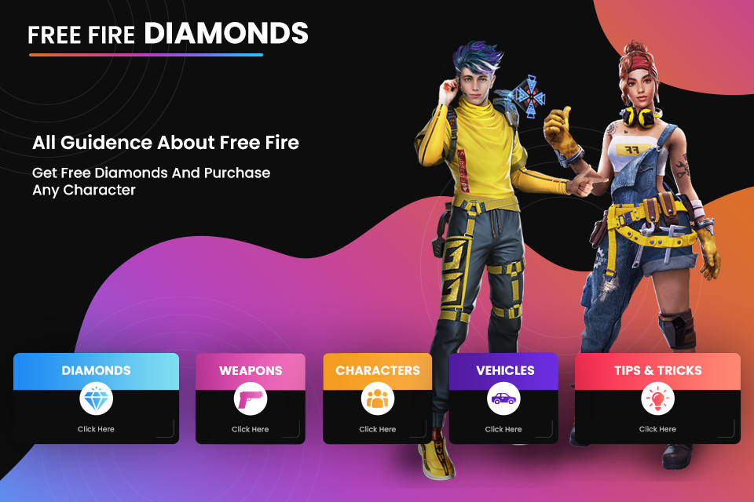
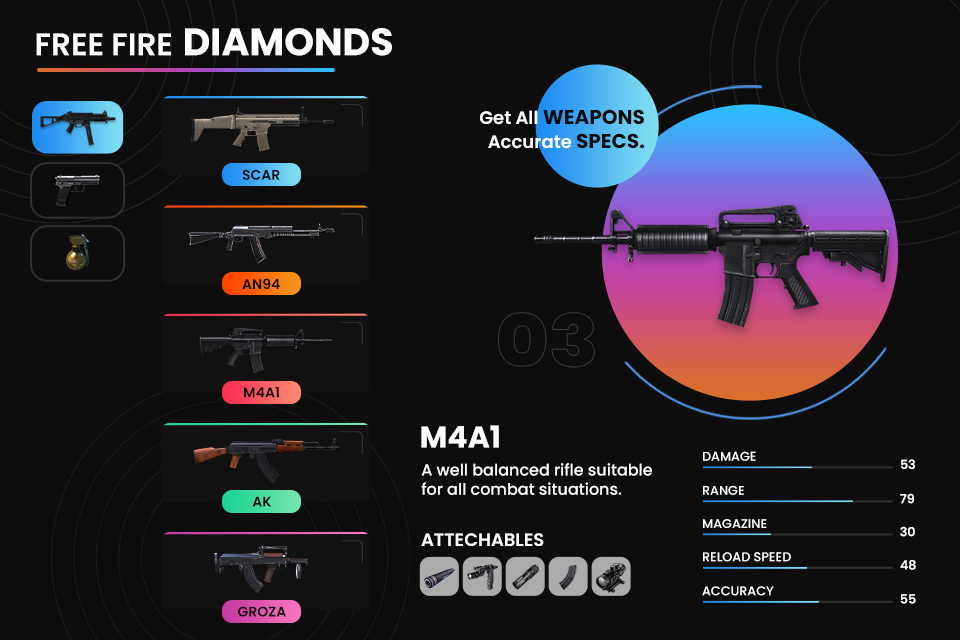
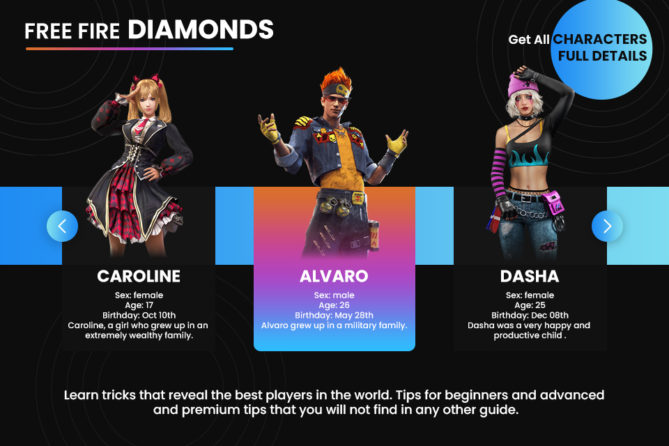
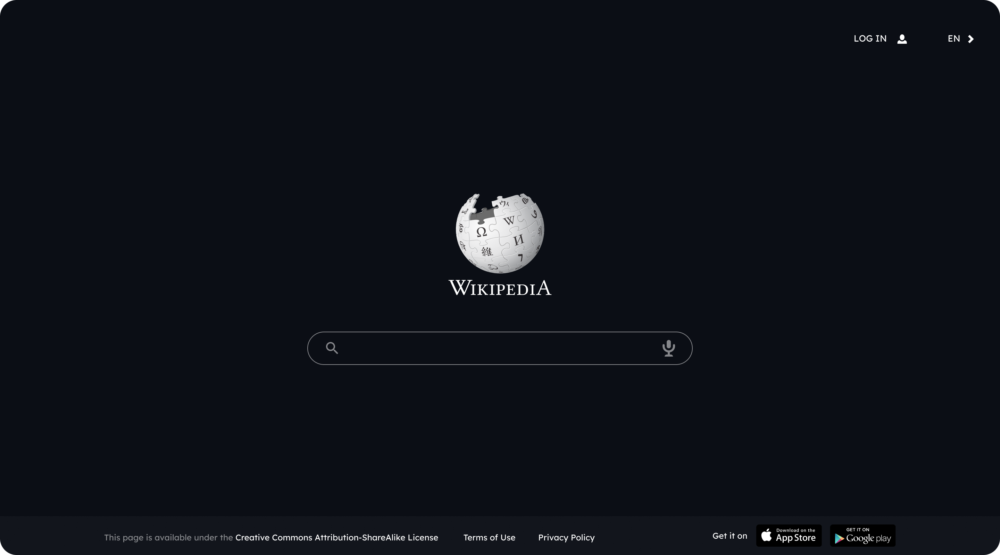

---

## About

UI/UX design work from my time as a **UI/UX Designer at Hevin Technoweb LLP** (Jan – Sep 2023). Two complete mobile app UI systems and a web redesign concept — covering brand identity, screen design, interaction flows, and Play Store marketing assets.

---

## Projects

 

### 01 — Free Fire Diamonds

> **Mobile companion app** for the Free Fire game. Complete UI system — brand identity, navigation, content screens, detail views, and Play Store assets.

 

&nbsp;

&nbsp;

 

**[→ View All Screens](free-fire-diamonds/screens/)**

---

 

### 02 — SkinTools

> **Free Fire skin and bundle companion app.** Distinct visual identity built around a bold diagonal card system — colour-coded categories, cinematic splash, and complete app flow.

 

 

**[→ View All Screens](skintools/screens/)**

---

 

### 03 — Wikipedia Redesign

> **Dark-mode UX redesign concept** for Wikipedia. Reimagined reading experience with improved visual hierarchy, modern typography, and a cleaner information architecture. Built as a fully interactive Figma prototype.

 

&nbsp;

 

**[→ View All Screens](wikipedia-redesign/screens/)**

---

 

## Skills

`UI Design` `Interaction Design` `Prototyping` `Mobile Design` `Visual Design` `Marketing Assets`

 

